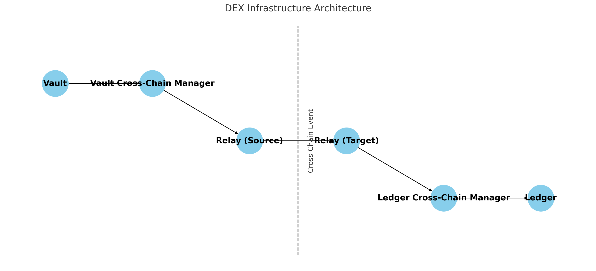

# Orderly Cross-Chain Service

## Table of Contents

- [1. Introduction](#1-introduction)
  - [Role And Responsiblility](#role-and-responsiblility)
  - [A simple example: deposit](#a-simple-example-deposit)
- [2. File Structure](#2-file-structure)
- [3. Get Started](#3-get-started)
- [4. Project configuration](#4-project-configuration)
  - [JSON config files `config/*.json`](#json-config-files-configjson)
  - [`.env` file](#env-file)
- [5. Usage](#5-usage)
  - [Preparation](#preparation)
    - [Add new support for a network named as XXX](#add-new-support-for-a-network-named-as-xxx)
  - [Steps of deployment&setup](#steps-of-deploymentsetup)
  - [Add a new cross-chain service on the new added vault chain](#add-a-new-cross-chain-service-on-the-new-added-vault-chain)
  - [generate new contract abi if necessary (if contract changed)](#generate-new-contract-abi-if-necessary-if-contract-changed)
- [6. Operation Scripts](#6-operation-scripts)
  - [6.1 The design of operation scripts](#61-the-design-of-operation-scripts)
  - [6.2 Script Sum Up](#62-script-sum-up)
- [7. Useful Commands](#7-useful-commands)
  - [change layerzero cross-chain airdrop gas](#change-layerzero-cross-chain-airdrop-gas)
  - [Retry payload when PayloadStored event found](#retry-payload-when-payloadstored-event-found)
  - [Start an "auto PayloadStored event monitor and retry" service](#start-an-auto-payloadstored-event-monitor-and-retry-service)
  - [Upgrade CC Manager](#upgrade-cc-manager)
- [8. Generate Typescript Wrapper](#8-generate-typescript-wrapper)
- [9. Deploy and Setup Cross Chain Service](#9-deploy-and-setup-cross-chain-service)
  - [9.1 Meta info setup](#91-meta-info-setup)
  - [9.2 vault ledger and operator address setup](#92-vault-ledger-and-operator-address-setup)
  - [9.3 set token decimal information](#93-set-token-decimal-information)
  - [9.4 deploy and setup cross-chain service](#94-deploy-and-setup-cross-chain-service)
- [10. verify contracts](#10-verify-contracts)
  - [verify contracts on blockscout](#verify-contracts-on-blockscout)
  - [verify on etherscan explorer](#verify-on-etherscan-explorer)
  - [possible issues with `forge verify-contract`](#possible-issues-with-forge-verify-contract)
- [11. print necessary information of cross-chain service](#11-print-necessary-information-of-cross-chain-service)
- [12. release new version](#12-release-new-version)
- [Issues](#issues)
- [License](#license)

## 1. Introduction

This project is built for providing cross-chain service for Orderly V2, which has components including multiple vaults, a dedicated ledger, cross-chain managers for both the vaults and the ledger, and cross-relay for each chain with our services. These components are deployed across blockchains, such as Ethereum, Arbitrum, and Avalanche. The vaults serve as secure repositories for user funds, while the ledger acts as a comprehensive database for all user-related information. To facilitate seamless communication between the vaults and the ledger—each residing on different blockchains—we have implemented dedicated cross-chain managers. These managers are tasked with converting messages into cross-chain payloads, enabling fluid inter-blockchain communication. Recognizing the variety of existing cross-chain solutions, a relay is positioned on each blockchain to encapsulate multiple cross-chain options. This relay plays a key role in transmitting messages from the cross-chain managers, thereby ensuring robust and flexible cross-chain interactions

### Role And Responsiblility

**cross-chain-relay**:

- receiving messages from cross-chain-managers
- sending messages received from the other chain to cross-chain-managers
- send message and payload through layerzero or other cross-chain method to the destination chain

**Ledger cross-chain-manager**:

- receiving message from cross-chain-relay and forward to ledger
- construct cross-chain message and payload and send then to cross-chain-relay
- convert messages sent from vault to ledger into the recognizeable type and forward to ledger
- convert token amount by using token decimal information for all message from and to vault on the other chain

**Vault cross-chain-manager**:

- receiving message from cross-chain-relay and forward to vault
- construct cross-chain message and payload and send then to cross-chain-relay
- convert messages sent from ledger on the other chain to vault into the recognizeable type and forward to vault

**Diagram:**



### A simple example: deposit

1. The vault receives a user's deposit request.

2. The deposit message is sent to the Vault Cross-Chain Manager.

3. The manager constructs a cross-chain message including source and target chain information.

4. This message is sent to the Relay on the source chain.

5. The Relay transmits the message to the target chain, where the Ledger is deployed.

6. The Relay on the target chain forwards the message to the Ledger Cross-Chain Manager.

7. This manager decodes the message and constructs a recognizable message for the Ledger.

8. Finally, the Ledger processes the deposit.

## 2. File Structure

Here's an overview of the main folders in this project and what they contain:

- `contracts/`: This folder houses all the Solidity smart contracts essential for the project's blockchain functionality.

- `script/`: Contains the base classes for various scripts along with utility functions and helpers.

- `foundry_ts/`: This directory stores typescript wrapper for foundry scripts, so that foundry scripts can be better utilized.

- `config/`: A general folder for storing project-related informations like contract address.

## 3. Get Started
To get started, you need to install the following dependencies and prepare some pre-settings:
* nodejs, yarn
* foundry
* follow the [Project configuration](#4-project-configuration) section to setup your project configuration
* install deps: yarn install
* build: forge build
* test: forge test

## 4. Project configuration

### JSON config files `config/*.json`

First of all, I will introduce the role of json files under `config`. Foundry scripts are not like javascript or ts. It is not that convenient to save deployment infos and projecte related infos into files. So we usually copy and paste the info into some place(confluence, or readme). But copy paste isn't a good habit. So I decide to put everything into json files automatically. So I write a helper base class for foundry scripts so that it can help users better read from and write to json files.

The json files under `config` is organized by `env` first, and then `network`, and then specific infos. Just like the following relay deployment example:

```json
  "staging": {
    "orderlyop": {
      "owner": "",
      "proxy": "",
      "relay": ""
    },
    "arbitrumgoerli": {
      "owner": "",
      "proxy": "",
      "relay": ""
    }
  }
```

The above example stores cross-chain-relay service's deployment address and owner information for staging environment. Because we are developing under a certain env, it would be better if we separate infos of different envs.

Other project related json files are oragized by the same way. The json file read and write helper foundry script is `baseScripts/ConfigHelper.s.sol` it wraps the read and write of cross-chain-relay infos and cross-chain-manager infos, and other useful helper functions.

### `.env` file

Beside json files under `config`, other public informations are stored in `.env`, and the example is `.env.example`.

in `.env` you can set your private keys, chain RPC URLs, chain Ids and other public information.

1. Setup available accounts(format like this: `ORDERLY_PRIVATE_KEY`, network name with `_PRIVATE_KEY`)

2. Setup RPC URLs

3. Setup Layerzero Endpoins addresses

## 5. Usage
In this section, I will introduce how to deploy evm-cross-chain service for orderly v2, and how to setup every contracts. Scripts organization and related file format will also be introduced.

### Preparation
You need prepare your `.env` file first. For every network you want to deploy, you need to set the following variables in `.env`.

#### Add new support for a network named as XXX

**for private key configuration**

1. set XXX_PRIVATE_KEY in .env

**for contract verification**

2. set etherscan key(if needed) and explorer api url in `.env` (for contract verification)

**for basic network configuration**

3. set XXX_CHAIN_ID in .env
4. set XXX_RPC_URL in .env
5. set XXX_LZ_CHAIN_ID in `.env` (for layerzero cross-chain support)
6. set XXX_ENDPOINT in `.env` (for layerzero cross-chain support)


### Steps of deployment&setup

This detailed steps of deployment is described in section [9. Deploy and Setup Cross Chain Service](9-deploy-and-setup-cross-chain-service). Here I will introduce the steps in a more general way.

1. deploy the implementation contract
2. deploy proxy contract
3. initialize the contract

After deployment, you need to setup the contracts. Cross-chain-relay and cross-chain-manager has different setup procedures. for cross-chain-relay, please follow the following setup procedure:

1. set the current chain Id
2. transfer native token to the proxy address, for future cross-chain consumption
3. set native chain Ids to layerzero chain Ids mapping
4. set the corresponding cross-chain-manager's address
5. set layerzero trusted remote

for ledger cross-chain-manager, the setup procedure is like:

1. set the the current chain Id
2. set the cross-chain-relay's address
3. set Ledger address
4. set token decimal information for different chains

for vault cross-chain-manager, the setup procedure is like:

1. set the the current chain Id
2. set the cross-chain-relay's address
3. set Vault address
4. set the ledger cross-chain-manager's network chain Id and the the address

Some components relies on other components, so you'd better deploy all of them so before your setup starts.

### Add a new cross-chain service on the new added vault chain
There are some times we need to add new vault chains. So we need to deploy cross-chain-relay and cross-chain-manager on the new added vault chain. And update settings of contracts on the ledger side. The following steps are the procedures of adding a new vault chain.

1. update token decimal in `config/token-decimals.json`, make sure the new added vault chain's token decimal is set correctly.
2. update project related infos in `config/project-related.json` (or you can update it later, if you choose to setup vault later, you should drop the --connectVault flag in the following script)
3. run a script to add a new cross-chain service on the new added vault chain and setup it and update ledger side contracts settings
```shell
ts-node foundry_ts/entry.ts --method addVaultCCService --env dev --vaultNetwork opgoerli --ledgerNetwork orderlyop --initEther 0.01 --broadcast --connectVault
```

If you didn't transfer enough token to the proxy address, you can run the following script to transfer more token to the proxy address:
```shell
ts-node foundry_ts/entry.ts --method transferNativeToken --network <network> --to <address> --ether <amount> --broadcast
```
If you didn't connect vault cross-chain-manager to vault in the above script, you can run the following script to connect them:
```shell
ts-node foundry_ts/entry.ts --method setCCManagerVault --env <env> --network <network> --broadcast
```
If you add new operations in cross-chain-relay or cross-chain-manager, you should also setup `config/cross-chain-method-gas.json`, and call the following script on every chain:
```shell
 ts-node foundry_ts/entry.ts --method setCrossChainFeeAll --env <env> --network <network> --broadcast
```

### generate new contract abi if necessary (if contract changed)
5. add git tag and push to github
6. update abi json file in [contract-abi](https://gitlab.com/orderlynetwork/orderly-v2/contract-abi)
7. fill the information on confluence [Orderly V2 Contract Information Board](https://wootraders.atlassian.net/wiki/spaces/ORDER/pages/343441906/Orderly+V2+Contract+Information+Board#Orderly-V2-Settlement-Layer) 
8. fill the balance monitor information to make sure enough balance on the new added vault cross-chain relay.

## 6. Operation Scripts

To better manage the complex procedures of cross-chain-relay and cross-chain-manager, we define the single operation of each step in above procedures as `operation`. Each operation is realized using a foundry script and a typescript wrapper. And some useful composite operations(includes several operations together) can be built using typescript wrapper (call several operations in one invocation).

Before we start on introducing the operation script structure. We need to introduce some helper scripts first. Because cross-chain-relay and cross-chain-manager has fixed procedures, so we don't need write a same operation again and again. Therefore, I provide some helper function in scripts to help users better build more other operations. For example, cross-chain-relay's helper script locates at `./script/baseScripts/RelayHelper.s.sol`, it implements all operations for cross-chain-relay. Cross-chain-manager's helper script locates at `./script/baseScripts/CCManagerHelper.s.sol`.

Now let's take a look at the structure of the actual operation scripts.

### 6.1 The design of operation scripts

First an operation implemented by a foundry script under `./script/foundry_scripts`. The file structure under `./script/foundry_scripts` depends on the role of the operations, relay's operations are placed under `relay`, cross-chain-manager's operations are placed under `ccmanager`. General operations like `retryPayload`, `transferNativeToken` is place under `./script/foundry_scripts`.

Every foundry script is wrapped by a typescript script. The required input arguments of foundry scripts are passed from typescript script's arguments. The arguments will be formatted as `FS_${operation_name}_${argument_name}` and set in `.env` by typescript, so that foundry script can read them by using `vm.env`. Let's take a look at an example, to see how a script is invoked.

To deploy cross-chain-relay, we first write a foundry script and inherit necessary base contracts and helper scripts.

```solidty
contract DeployRelay is BaseScript, ConfigHelper, RelayHelper {...}
```

deploy a cross-chain-relay, you need to know what current env is and which network to deploy. So, you need `env` and `network`, let we name this operation as `deployRelay`. Then the variables set int `.env` will be `FS_deployRelay_env` and `FS_deployRelay_network`.

You need to read these arguments from `.env` and deploy cross-chain-relay.

But manually set values in `.env` is not a wise choice, so we let the typescript wrapper to do that (every foundry scripts has a typescript wrapper).

```typescript
export function deployRelay(
  env: string,
  network: string,
  broadcast: boolean,
  simulate: boolean
) {
  setupDeployJson(relay_deploy_json, env, network, "relay");
  set_env_var(method_name, "env", env);
  set_env_var(method_name, "network", network);
  set_env_var(method_name, "broadcast", broadcast.toString());
  foundry_wrapper(method_name, broadcast, simulate);
}
```

The above function is from the typescript wrapper. It first setup the json file for storing the deployment infos (as we explained in previous section, we let the foundry script automatically save the deployment infos, but because of the limitation of foundry script, we setup it using typescript first).

Then it setup `.env` for foundry script to read. Finally it invokes the foundry script by calling foundry wrapper function.

This function is from `./foundry_ts/methods/relay/deployRelay.ts`.

after writing the above function, we need also register the operation, so that we can use a unified command line scripts to invoke operations.

```typescript
export function deployRelayWithArgv(argv: any) {
  const required_flags = ["env", "network"];
  checkArgs(method_name, argv, required_flags);
  deployRelay(argv.env, argv.network, argv.broadcast, argv.simulate);
}

addOperation(method_name, deployRelayWithArgv);
```

the first function checks the required arguments are passed and then invoke the operation. And then calling `addOperation` to register the operation.

After finishing above programming, we can call `deployRelay` using command line:

```shell
ts-node foundry_ts/entry.ts --method deployRelay --env qa --network eth --broadcast --simulate
```

you may notice there are two more arguments `--broadcast` and `--simulate`, if `--broadcast` is present, then the tx will be broadcast, if `--simulate` is present then the foundry script will not get executed, it will only print the command that invoke the foundry script.

(PS: because we are using minimum argument parser, we have little limitation on the type of arugment, so if you want to read bytes, you should define your argument name as `bytes`, because it is manually set as string in the script, or else hex strings will be parsed as integers.)

### 6.2 Script Sum Up

To add a new script, 1. you need to write a foundry script first, and then 2. add a typescript wrapper and 3. register the operation into the script.

Of course you can start will existing typescript operations, and just add a new typescript operation by calling several existing typescript operations. In this way, you are building more complex operations and don't need to write a foundry script. But you also have to register it.

The second way of adding new script using typescript is recommended. Foundry script should be regarded as low-level invocation of contract operation. Complex operations that are more useful in real situation should be implemented in typescript.

## 7. Useful Commands 

### change layerzero cross-chain airdrop gas

here is a sample command line:

```shell
ts-node foundry_ts/entry.ts --method setCrossChainFee --ccmethod pingPong --fee 500000 --env dev --network orderlyop --broadcast
```

### Retry payload when PayloadStored event found

```shell
ts-node foundry_ts/entry.ts --method retryPayload --env staging --network arbitrumgoerli --data <0x> --broadcast
```

### Upgrade CC Manager

```shell
ts-node foundry_ts/entry.ts --method upgradeCCManager --env dev --network arbitrumgoerli --role vault --broadcast
```

change the `env` `network` `role` into the correct value according to your goal.

## 8. Generate Typescript Wrapper

I implement a code generator for foundry script wrapper. Simply run:

```shell
ts-node foundry_ts/genCode.ts --role relay --sol foundry_scripts/relay/sendPingPong.s.sol
```

pass the role(relay or ccmanager) and the path of the foundry script, then the foundry wrapper script will be generated.

make sure that you set your method name same with the foundry script file name. Which mean in the above example, you should read your arguments as `FS_sendPingPong_xxx` from env.

## 9. Deploy and Setup Cross Chain Service

### 9.1 Meta info setup

before you start deployment, you should have several variables set up in `.env`:

- network private key
- network chain id
- network rpc url
- network layerzero chain id
- network layerzero endpoint address

### 9.2 vault ledger and operator address setup

set vault ledger and operator address in `config/project-related.json`

### 9.3 set token decimal information

set token decimal information in `config/token-decimals.json`

### 9.4 deploy and setup cross-chain service

we have a integrated script for deploying cross-chain relay and cross-chain manager. you can run the following command to deploy and setup cross-chain service:

```shell
ts-node foundry_ts/entry.ts --method deployAndSetupAnEnv --env production --vaultNetwork arbitrum --ledgerNetwork orderlymain --initEther 1 --broadcast
```

`--initEther` has no effect right now. We require you manually transfer native later after this script.

## 10. verify contracts

### verify contracts on blockscout

to verify your contracts on blockscout, you should run the following command:

```shell
forge verify-contract <address> <contract-path>:<contract-name> --chain-id <chain-id> --verifier-url https://testnet-explorer.orderly.org/api\? --verifier blockscout
```

or you can verify using the following script. It will automatically find the address of contract and verify it on blockscout.

```shell
ts-node foundry_ts/entry.ts --method verifyContract --contract <CCRelay|VaultCCManager|LedgerCCManager> --network <network> --env <env> 
````

this example shows how you can verify the contract on orderly L2 chain. The reason for the `\?` suffix of the verifier-url is discussed on a github issue: https://github.com/foundry-rs/foundry/issues/5160.

### verify on etherscan explorer

here is a sample command:

```shell
forge verify-contract <contract-address> contracts/CrossChainRelayUpgradeable.sol:CrossChainRelayUpgradeable --chain-id 421613 --verifier-url https://api-goerli.arbiscan.io/api -e <etherscan-api-key>
```

or you can verify using the following script. It will automatically find the address of contract and verify it on etherscan like explorers:

```shell
ts-node foundry_ts/entry.ts --method verifyContract --contract VaultCCManager  --network arbitrum --env production
```

the example above shows how you can verify contract arbitrum goerli network, whose explorer api is: `https://api-goerli.arbiscan.io/api`. Because it uses infrastructure the same as etherscan, so we can use the same verification way to verify contracts on arbitrum goerli. arbitrum-goerli's etherscan api key is shared with arbitrum's mainnet. So, you can generate an api key using the mainnet explorer, cause' arbitrum-goerli's explorer has no where to do that.

### possible issues with `forge verify-contract`

verifing contracts using `forge verfiy-contract` sometimes may not work. It will print `OK`, but if you check the explorer, you will find the contract is not verified. It could possibly be the wrong constructor arguments or the compiler version. So you have to pass `--constructor-args` with abi encoded constructor arguments and `--compiler-version` with the compiler version used to compile the contract. Or you can output the standard json input or the flattened contract souce and verify it on explorer manually.

* generate standard json input
```shell
forge verify-contract --chain-id <id> --verifier-url <url> -e <key> --show-standard-json-input <address> <contract> > standard.json
```
* generate flattened solidity file
```shell
forge flatten <contract> > flattened.sol
```

then you can verify it on explorer using the generated standard json input or flattened solidity file. Make sure you set the constructor arguments correctly. You can goto `https://abi.hashex.org/` to get the abi encoded constructor arguments.


## 11. print necessary information of cross-chain service

simple run the following command:

print cross-chain relay information on chain:

```shell
ts-node foundry_ts/entry.ts --method printRelay --env production --network arbitrum --dstNetwork orderlymain
```

print cross-chain manager vault side information on chain:

```shell
ts-node foundry_ts/entry.ts --method printCCManagerVault --env production --network arbitru
```

print cross-chain manager ledger side information on chain:

```shell
ts-node foundry_ts/entry.ts --method printCCManagerLedger --env production --network orderlymain
```

print token decimal configuration on chain:

```shell
ts-node foundry_ts/entry.ts --method printCCManagerTokenDecimal --env production --network orderlymain
```

you need to change the parameters to suit your needs.

## 12. release new version
To release a new version on dev, qa, staging or production, you need to follow the following steps:
1. make sure features are all complete
2. make sure you write tests on those features, and tests passed
3. copy the new abi to abi folder
4. deploy and setup the new version on dev, qa, staging or production
5. add git tag and push to github

# Issues

1. if you put urls like https://testnet-explorer.orderly.org/api\? into `.env` file. foundry script will have problem parsing `.env`. you need to use "" to enclose it and add `\` to escape the parsing. so it will be like:
   "https://testnet-explorer.orderly.org/api\\\\?"

2. Oracle backoff: 
In a certain situation, oracle could be backoff for a long time, which will block relayer for a long time. Then txs could be in pending. The cause of oracle backoff is Orderly chain stopping mining.

# License

[MIT License](LICENSE)
