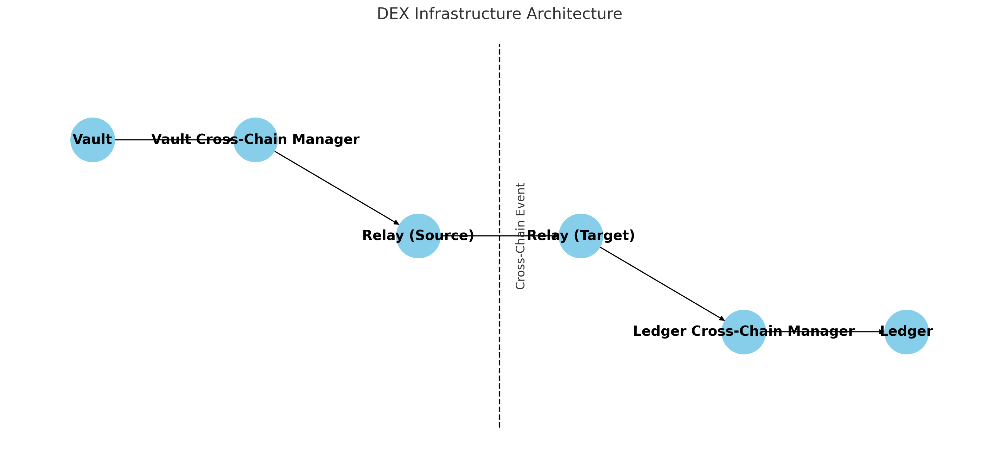
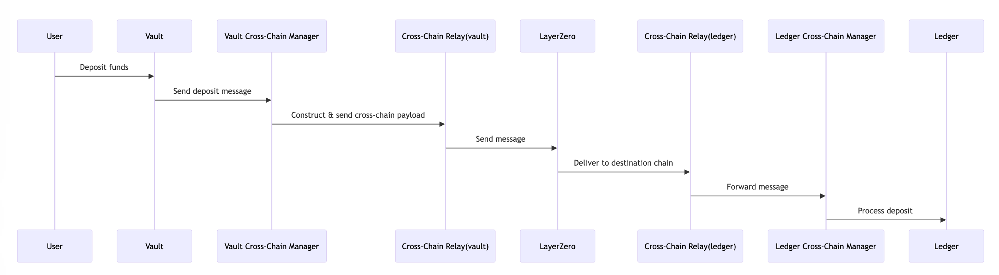
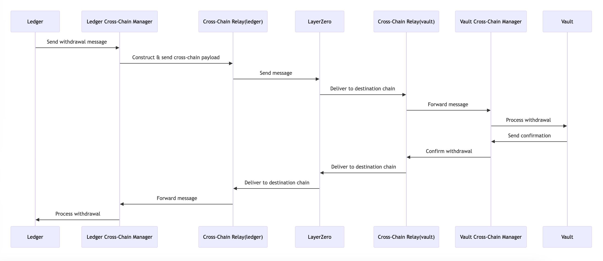

# Orderly Cross-Chain Service

A cross-chain messaging system built for Orderly Network, enabling seamless communication between vaults on various EVM chains and the Orderly ledger. The system utilizes LayerZero as its underlying cross-chain messaging protocol.

## Overview

The Orderly Cross-Chain Service facilitates secure cross-chain communication between:
- Multiple vaults deployed across different EVM chains (e.g., Ethereum, Arbitrum, Avalanche)
- A central ledger deployed on the Orderly chain

### Key Components

1. **Cross-Chain Relay**: An abstraction layer over LayerZero that standardizes cross-chain messaging
2. **Vault Cross-Chain Manager**: Handles message conversion and routing for vault contracts
3. **Ledger Cross-Chain Manager**: Manages message conversion and routing for the ledger contract

## Architecture



### Message Flow Examples

#### Deposit Flow


1. User deposits funds into a vault on an EVM chain
2. The vault sends a deposit message to the Vault Cross-Chain Manager
3. The Vault Cross-Chain Manager constructs and sends a cross-chain payload to the Cross-Chain Relay
4. The Cross-Chain Relay sends the message to LayerZero
5. LayerZero delivers the message to the destination chain
6. The destination chain's Cross-Chain Relay forwards the message to the Ledger Cross-Chain Manager
7. The Ledger Cross-Chain Manager processes the deposit

# Withdraw Flow

1. Ledger sends a withdrawal message to the Ledger Cross-Chain Manager
2. The Ledger Cross-Chain Manager constructs and sends a cross-chain payload to the Cross-Chain Relay
3. The Cross-Chain Relay sends the message to LayerZero
4. LayerZero delivers the message to the destination chain
5. The destination chain's Cross-Chain Relay forwards the message to the Vault Cross-Chain Manager
6. The Vault Cross-Chain Manager processes the withdrawal
7. The Vault sends a confirmation message to the Cross-Chain Relay
8. The Cross-Chain Relay sends the message to LayerZero
9. LayerZero delivers the message to the source chain
10. The source chain's Cross-Chain Relay forwards the message to the Ledger Cross-Chain Manager
11. The Ledger Cross-Chain Manager processes the withdrawal


## Getting Started

### Prerequisites

- Node.js (v20+) & Yarn
- Foundry (latest version)

### Installation

1. Install dependencies
```bash
git submodule update --init
yarn install
forge install
```

2. Copy and configure environment variables
```bash
cp .env.example .env
```

### Configuration

#### 1. Environment Setup (.env)

For each network you want to deploy to, configure the following in `.env`:

```shell
# Private key for deployment
DEV_PK= # Private key for dev environment
QA_PK= # Private key for qa environment
STAGING_PK= # Private key for staging environment
PRODUCTION_PK= # Private key for production environment


# Network Configuration
XXX_RPC_URL=           # RPC endpoint URL
XXX_CHAIN_ID=          # Chain ID (e.g., 1 for Ethereum mainnet)
XXX_LZ_CHAIN_ID=       # LayerZero chain ID
XXX_ENDPOINT=          # LayerZero endpoint address

# Explorer Configuration (for verification)
XXX_EXPLORER_API_URL=  # Explorer API URL
XXX_EXPLORER_API_KEY=  # Explorer API key
XXX_EXPLORER_TYPE=     # Explorer type (e.g., etherscan, blockscout)
```

Replace `XXX` with your network name (e.g., ETH, ARBITRUM, etc.)

#### 2. Token Configuration

Configure USDC decimal in `config/token-decimals.json`:

```json
{
    "default": {
        "name": "USDC",
        "tokenHash": "0xd6aca1be9729c13d677335161321649cccae6a591554772516700f986f942eaa",
        "decimals": 6
    },
    "chain-name": {
        "name": "token-name",
        "tokenHash": "token-hash",
        "decimals": "decimals"
    }
}
```
If USDC's decimal is not in the default on some chain, you can add it to the `chain-name` section.

#### 3. Project Configuration

Set up project-related addresses in `config/project-related.json`:

```json
{
  "production": {
    "arbitrum": {
      "vault": "0x...",
    },
    "orderlymain": {
      "ledger": "0x...",
      "operator-manager": "0x..."
    }
  },
  "dev": {
    "fuji": {
      "vault": "0x..."
    },
    "orderlyop": {
      "ledger": "0x...",
      "operator-manager": "0x..."
    }
  }
  ...
}
```
You can add more environments and chains as needed. These addresses are retrieved from `contract-evm` project, which implements the vault and ledger contracts.

#### 4. Cross-Chain Gas Configuration

Configure cross-chain method gas limits in `config/cross-chain-method-gas.json`:

```json
{
    "withdraw": 400000,
    "deposit": 300000,
    "withdrawFinish": 200000,
    "pingPong": 500000,
    "ping": 500000,
    "burn": 450000,
    "burnFinish": 280000,
    "mint": 550000,
    "mintFinish": 280000
}
```
Different cross-chain methods have different gas limits. You can set the gas limit for each method in the `config/cross-chain-method-gas.json` file.

## Build & Test

```bash
forge build
forge test
```

## Deployment

### Deploy Full Cross-Chain Service

This will deploy and set up the entire cross-chain infrastructure:

```bash
ts-node script/foundry_ts/entry.ts --method deployAndSetupAnEnv \
    --env production \
    --vaultNetwork arbitrum \
    --ledgerNetwork orderlymain \
    --initEther 1 \
    --broadcast
```

The deployment process includes:
1. Deploying implementation contracts
2. Deploying proxy contracts
3. Initializing contracts
4. Setting up cross-chain configurations
5. Connecting components together

### Add New Vault Chain

To add support for a new chain:

1. Configure the new chain in `.env` as described above
2. Update token decimals in `config/token-decimals.json`
3. Update project configuration in `config/project-related.json`
4. Deploy cross-chain service:

```bash
ts-node script/foundry_ts/entry.ts --method addVaultCCService \
    --env dev \
    --vaultNetwork newchain \
    --ledgerNetwork orderlyop \
    --initEther 0.01 \
    --broadcast \
    --connectVault \
    --multisig
```
For steps 1-3, you can also run this script to setup the environment, and follow the prompts to setup the environment:
```bash
ts-node script/setupChainConfig.ts <env> <chain-name>
```

## Operation & Maintenance

### Update Cross-Chain Gas Fees

```bash
ts-node foundry_ts/entry.ts --method setCrossChainFee \
    --ccmethod pingPong \
    --fee 500000 \
    --env dev \
    --network orderlyop \
    --broadcast
```

### Retry Failed Messages

```bash
ts-node foundry_ts/entry.ts --method retryPayload \
    --env staging \
    --network arbitrumgoerli \
    --data <payload-data> \
    --broadcast
```

### Contract Verification

```bash
ts-node script/foundry_ts/entry.ts --method verifyContract \
    --contract CCRelay \
    --network arbitrum \
    --env production
```

## Development

### Project Structure

```
├── contracts/           # Smart contracts
├── script/
│   ├── foundry_scripts/  # Foundry deployment scripts
│   └── foundry_ts/      # TypeScript wrappers
├── config/             # Configuration files
└── test/              # Test files
```


## License

[MIT License](LICENSE)
